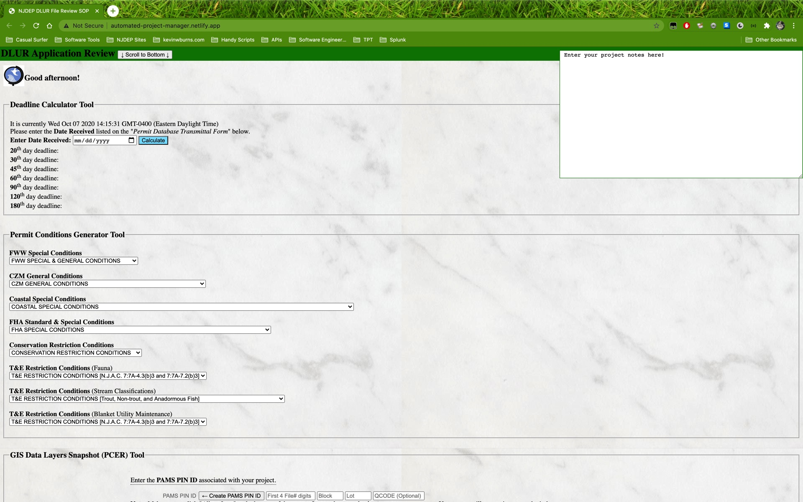

# NJDEP-Application-PreReview
A desktop application that guides an Environmental Specialist through the review process of any permit application at the New Jersey Department of Environmental Protection, Department of Land Use Regulation.
This application is designed to sit on the Environmental Specialist's desktop, and provide specific information needed to process any permit application they may receive. 
The application will obviate much of the training and oversight provided by Training Managers and Senior Permit Writers. 
The application will serve as a training aid for the uninitiated, and as a reference manual for those who are familiar with the permit writing process. 

<p align="center">
  
  </p>


## Issues and Challenges!
There are multiple issues with this application, especially if you are reviewing the code base for semantics and syntax. The primary causes of these issues stem from the following challenges.

1. This was the very first production app I developed. At the time of it's development, I had been coding for a few weeks. I was unfamiliar with common naming conventions, libraries, data structures, etc. My primary concern was to develop a useful tool for myself and my colleagues. 

2. The project had to be developed in one HTML file. I could not use a folder structure to maintain basic "separation of concerns." As glamorous or smart as someone may perceive scientists, I can assure you that many of us are not as computer savvy as one may imagine. This app was designed and intended for use by everyone in my department, including those who do not understand computers. Good software gets out of your way, right? The moment the program took on a file structure, I would have to deal with partial downloads, fragmented code bases, and otherwise become a help desk assistant. Placing the entire code base in one file was an engineering control, and a decision I made, knowing it would draw some ire from anyone who prioritizes easy-to-maintain code. The program was designed for the computer-illiterate user to download from an email as an attachment, drag it onto their desktop, and use it on their government machine without the need for configuration... which brings me to my next point.

3. The program was developed with absolutely *no developer tools*. That's right. I wrote this entire code base in Windows Notepad. I tested my JavaScript in the browser console, or in a online code editor. I also had to make the program work on really slow government computers for users that either can't or won't conduct basic maintenance and upkeep on their machines. This means that everything had to work on Internet Explorer. Very early versions of Internet Explorer. To be clear, I am not salty about this; it made me a better software developer, after all! But the fact bears mentioning, since it adds context to the code base. A note to your tech leads and senior devs: I am glad to discuss aspects of this code base and what can be done to make it better, but please keep in mind that this is something I worked on several years ago and does not reflect how I write code today. You can find contemporary examples of totally decent JavaScript elsewhere in my repos. This project is pinned to my front page for, among many reasons, sentimental value (of which I am enthusiastic to discuss!). 

## Installation
You could clone the repo, click the download button, or just copy/paste the code into your code editor; it's only a few files. 

```bash
$ git clone https://github.com/kevintage83/NJDEP-Application-PreReview
```

## Usage (Windows)
```bash
cmd /c start NJDEP-Application-PreReview
```

## Usage (MacOS X)
```bash
open NJDEP-Application-PreReview
```

## Usage (Linux/Unix)
```bash
xdg-open NJDEP-Application-PreReview
```

## Contributing
This application is not open for pull requests. The repo is mainly a conversation piece. Normally, if this were a repository where pull requests were welcome, I would ask that (for major changes, at least) you please open an issue first to discuss what you would like to change.

I would also ask that you please make sure to update tests as appropriate.

## License
[MIT](https://choosealicense.com/licenses/mit/)
